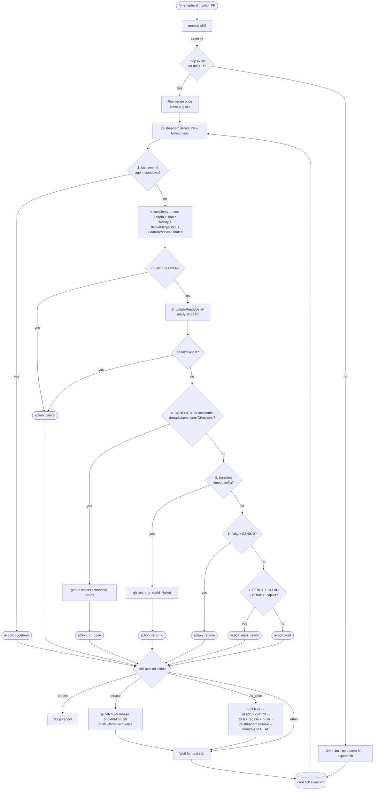

# pr-shepherd

Autonomous PR CI monitor and review-comment resolver for Claude Code.

## Goals

- **Reduced context** — shifts more logic to the CLI instead of the agent
- **Reduced GitHub rate limit exhaustion** — all GraphQL queries are batched
- **Reduced agent tool calls** — batching comment resolutions means fewer tool calls and less context used
- **No MCP** — less reasoning and much faster than using the GitHub MCP
- **CI cancellation on failure** — avoids wasted CI runs when actionable failures exist
- **Auto-resolution of all inline comments** — including bot and AI reviewer comments
- **Automatic resolution of outdated comments** — happens before the agent is involved
- **Automatic pagination and filtering** — resolved comments never reach the agent
- **Aggressively hides bot comments** — keeps PR noise low
- **Waits for pending Copilot reviews** — avoids premature marking as ready
- **Rebases on conflict** — automatically rebases on the PR base branch when there are merge conflicts
- **4-minute watch cadence** — keeps Claude's prompt cache warm (5-minute TTL)
- **10-minute settle window** — waits after the PR is clean before exiting, in case of pending reviews
- **Draft → ready-for-review** — automatically converts draft PRs when CI passes
- **Skips non-PR CI checks** — only `pull_request` / `pull_request_target` events count toward readiness
- **Intended as a PR merge blocker** — pair with a GitHub Actions required check that verifies all threads are resolved

## Why it's built this way

Claude's cloud autofix requires CI to verify changes for apps that can't run in the cloud. Running targeted tests locally and letting Claude Code drive is cheaper and avoids vendor lock-in. Skills are used (not subagents) because subagents load all CLAUDE.md context, increasing cost; skills inject into the main conversation instead.

## Requirements

- Node.js ≥ 24.0.0
- `gh` CLI authenticated (`gh auth login`)
- `git`

## Install

```bash
npm install pr-shepherd
```

### As a Claude Code plugin

```bash
# Install from marketplace
claude /plugin marketplace add jonathanong/pr-shepherd
claude /plugin install pr-shepherd
```

See [Usage](#usage) below.

### Without the plugin — custom slash command

If you don't want the full plugin, create a project-local (or user-scope)
slash command that wraps the CLI directly.

1. **Create the command file:**
   - Project-scope: `.claude/commands/pr-check.md`
   - User-scope: `~/.claude/commands/pr-check.md`

2. **Paste this as the file contents:**

   ````markdown
   ---
   description: "Check GitHub CI status and review comments for the current PR"
   argument-hint: "[PR number or URL ...]"
   allowed-tools: ["Bash", "Read", "Grep"]
   ---

   # PR Status Check

   ## Arguments: $ARGUMENTS

   ## Resolve PR number(s)

   1. If `$ARGUMENTS` contains PR numbers or GitHub PR URLs, extract the number(s).
   2. Otherwise, infer: `gh pr list --head "$(git rev-parse --abbrev-ref HEAD)" --json number --jq '.[0].number'`
   3. If no PR found, report an error and stop.

   ## Run the check

   ```bash
   npx pr-shepherd check <PR_NUMBER> --format=json
   ```

   Parse the JSON and report:

   - **Merge status** (`report.mergeStatus.status`): CLEAN | BEHIND | CONFLICTS | BLOCKED | UNSTABLE | DRAFT | UNKNOWN
   - **CI check results** (`report.checks`): passing count, failing names, in-progress names
   - **Unresolved review comments** (`report.threads.actionable` + `report.comments.actionable`): count + details
   ````

3. **Use it in Claude Code:**

   ```
   /pr-check
   /pr-check 42
   ```

For `monitor` and `resolve` equivalents, copy
[`skills/monitor/SKILL.md`](skills/monitor/SKILL.md) and
[`skills/resolve/SKILL.md`](skills/resolve/SKILL.md) the same way. To drive
the CLI without Claude at all, see [docs/usage.md](docs/usage.md).

## Usage

### Monitor a PR

Creates a cron loop that fires every 4 minutes, checks CI and review
comments, fixes issues, and marks the PR ready for review when clean. The
loop cancels automatically when the PR is merged or closed.

```
/pr-shepherd:monitor                     # infer PR from current branch
/pr-shepherd:monitor 42
/pr-shepherd:monitor 42 every 8m
/pr-shepherd:monitor 42 --ready-delay 15m
```

### Check a PR

One-shot status snapshot — merge state, CI results, and unresolved comments.
Accepts multiple PR numbers.

```
/pr-shepherd:check        # infer from branch
/pr-shepherd:check 42
/pr-shepherd:check 41 42 43
```

### Resolve review comments

Fetches all actionable threads and comments, triages them, applies fixes,
pushes, then resolves/minimizes/dismisses via `--require-sha` (waits until
GitHub has seen the push before resolving).

```
/pr-shepherd:resolve       # infer from branch
/pr-shepherd:resolve 42
```

See [docs/skills.md](docs/skills.md) for full argument reference.

## Workflow



## CLI

```sh
pr-shepherd check [PR]                                # read-only PR status snapshot
pr-shepherd resolve [PR] [--fetch | --resolve-thread-ids …]
pr-shepherd iterate [PR] [--cooldown-seconds N] [--ready-delay Nm] [--last-push-time N]
pr-shepherd status PR1 [PR2 …]                        # multi-PR table
```

Common flags:

| Flag                  | Default | Description                     |
| --------------------- | ------- | ------------------------------- |
| `--format text\|json` | `text`  | Output format                   |
| `--no-cache`          | false   | Bypass the 5-minute file cache  |
| `--cache-ttl N`       | 300     | Cache TTL in seconds            |
| `--ready-delay Nm`    | `10m`   | Settle window before loop exits |

## Configuration

Create a `.pr-shepherdrc.yml` in your project root (or any parent directory) to override defaults:

```yaml
iterate:
  cooldownSeconds: 60 # wait longer after a push before reading CI
  fixAttemptsPerThread: 5 # raise before escalating to manual review
checks:
  ciTriggerEvents:
    - pull_request
    - pull_request_target
    - merge_group # add for merge-queue repos
mergeStatus:
  blockingReviewerLogins:
    - copilot # add other review bots here
actions:
  autoRebase: false # disable for repos that enforce merge commits
```

See [docs/configuration.md](docs/configuration.md) for all options.

## Architecture

See [docs/architecture.md](docs/architecture.md) and [docs/](docs/) for full reference docs.

## Forking

If you want to customize pr-shepherd for your own use or team, see [docs/forking.md](docs/forking.md).

## License

[MIT](LICENSE)
