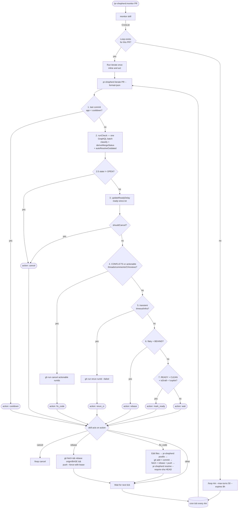

# pr-shepherd

Autonomous PR CI monitor and review-comment resolver for Claude Code.

## Goals

- **Reduced context** — shifts more logic to the CLI instead of the agent
- **Reduced GitHub rate limit exhaustion** — all GraphQL queries are batched
- **Reduced agent tool calls** — batching comment resolutions means fewer tool calls and less context used
- **No MCP** — less reasoning and much faster than using the GitHub MCP
- **CI cancellation on failure** — avoids wasted CI runs when actionable failures exist
- **Auto-resolution of all inline comments** — including bot and AI reviewer comments
- **Automatic resolution of outdated comments** — happens before the agent is involved
- **Automatic pagination and filtering** — resolved comments never reach the agent
- **Aggressively hides bot comments** — keeps PR noise low
- **Waits for pending Copilot reviews** — avoids premature marking as ready
- **Rebases on conflict** — automatically rebases on the PR base branch when there are merge conflicts
- **4-minute watch cadence** — keeps Claude's prompt cache warm (5-minute TTL)
- **10-minute settle window** — waits after the PR is clean before exiting, in case of pending reviews
- **Draft → ready-for-review** — automatically converts draft PRs when CI passes
- **Skips non-PR CI checks** — only `pull_request` / `pull_request_target` events count toward readiness
- **Intended as a PR merge blocker** — pair with a GitHub Actions required check that verifies all threads are resolved

## Why it's built this way

Claude's cloud autofix requires CI to verify changes for apps that can't run in the cloud. Running targeted tests locally and letting Claude Code drive is cheaper and avoids vendor lock-in. Skills are used (not subagents) because subagents load all CLAUDE.md context, increasing cost; skills inject into the main conversation instead.

## Install

```bash
npm install -g pr-shepherd
```

### As a Claude Code plugin

```bash
# Install from marketplace
claude /plugin marketplace add jonathanong/pr-shepherd
claude /plugin install pr-shepherd
```

Then use:
- `/pr-shepherd:monitor [PR]` — start continuous monitoring
- `/pr-shepherd:check [PR]` — one-shot status check
- `/pr-shepherd:resolve [PR]` — fetch, fix, and resolve review comments

## Workflow



## CLI

```sh
pr-shepherd check [PR]                                # read-only PR status snapshot
pr-shepherd resolve [PR] [--fetch | --resolve-thread-ids …]
pr-shepherd iterate [PR] [--cooldown-seconds N] [--ready-delay Nm] [--last-push-time N]
pr-shepherd status PR1 [PR2 …]                        # multi-PR table
pr-shepherd postfix                                   # run configured postFixCommands
```

Common flags:

| Flag | Default | Description |
| --- | --- | --- |
| `--format text\|json` | `text` | Output format |
| `--no-cache` | false | Bypass the 5-minute file cache |
| `--cache-ttl N` | 300 | Cache TTL in seconds |
| `--ready-delay Nm` | `10m` | Settle window before loop exits |

## Configuration

Create a `.pr-shepherdrc.yml` in your project root (or any parent directory):

```yaml
postFixCommands:
  - npx oxlint --fix
  - npx oxfmt

commitMessage: 'fix: address review comments'

# baseBranch: null  # auto-detect from PR (default)
```

See [docs/configuration.md](docs/configuration.md) for all options.

## Requirements

- Node.js ≥ 24.0.0
- `gh` CLI authenticated (`gh auth login`)
- `git`

## Architecture

See [docs/architecture.md](docs/architecture.md) and [docs/](docs/) for full reference docs.

## Forking

If you want to customize pr-shepherd for your own use or team, see [docs/forking.md](docs/forking.md).

## License

[MIT](LICENSE)
