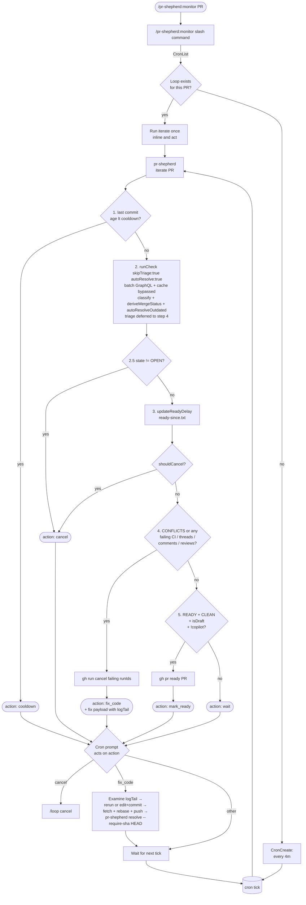

# Shepherd — End-to-End Flow

```mermaid
flowchart TD
  U(["/pr-shepherd:monitor PR"]) --> SC["/pr-shepherd:monitor slash command"]
  SC -->|CronList| EX{Loop exists<br/>for this PR?}
  EX -->|yes| NOW[Run iterate once<br/>inline and act]
  EX -->|no| CREATE[CronCreate:<br/>every 4m]
  CREATE --> CRON[(cron tick)]
  NOW --> ITER
  CRON --> ITER[pr-shepherd<br/>iterate PR]

  ITER --> S1{1. last commit<br/>age lt cooldown?}
  S1 -->|yes| A_COOL([action: cooldown])
  S1 -->|no| S2[2. runCheck skipTriage:true autoResolve:true<br/>batch GraphQL + cache bypassed<br/>classify + deriveMergeStatus + autoResolveOutdated<br/>triage deferred to step 4]

  S2 --> S25{2.5 state != OPEN?}
  S25 -->|yes| A_CAN([action: cancel])
  S25 -->|no| S3[3. updateReadyDelay<br/>ready-since.txt]
  S3 --> S3C{shouldCancel?}
  S3C -->|yes| A_CAN
  S3C -->|no| S4{4. CONFLICTS or any<br/>failing CI / threads /<br/>comments / reviews?}
  S4 -->|yes| S4X[gh run cancel failing runIds]
  S4X --> A_FIX([action: fix_code<br/>+ fix payload with logTail])
  S4 -->|no| S5{5. READY + CLEAN<br/>+ isDraft<br/>+ !copilot?}
  S5 -->|yes| S5X[gh pr ready PR]
  S5X --> A_MR([action: mark_ready])
  S5 -->|no| A_W([action: wait])

  A_COOL --> DEC{Cron prompt<br/>acts on action}
  A_CAN --> DEC
  A_FIX --> DEC
  A_MR --> DEC
  A_W --> DEC

  DEC -->|cancel| STOP["/loop cancel"]
  DEC -->|fix_code| FIX[Examine logTail →<br/>rerun or edit+commit →<br/>fetch + rebase + push →<br/>pr-shepherd resolve --require-sha HEAD]
  FIX --> NEXT[Wait for next tick]
  DEC -->|other| NEXT
  NEXT --> CRON
```
