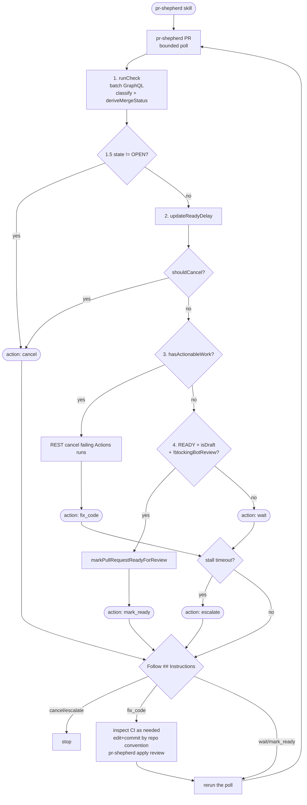

# shepherd iterate — dispatch flow

[← README](../README.md) | [actions.md](actions.md) | [context.md](context.md)

`commands/iterate/index.mts` is the heart of the iterate loop. Each tick gathers context, then returns exactly one action. The caller follows the `## Instructions` in the result.

## End-to-end

The shipped skill runs the **poll** command `pr-shepherd`, not `pr-shepherd iterate`. After the first `FIX_CODE`, poll holds `--debounce` (default 1m) while still iterating at `--interval`, then returns one later tick. MCP `iterate` has no debounce; the client owns recurrence.

## Steps

### 1. Sweep

**What:** `runCheck({ autoResolve: true })` fires one GraphQL batch query (CI checks + review threads + PR comments + merge state + branch rules). If the PR is already merged or closed, it returns a terminal report immediately; otherwise it surfaces outdated threads without resolving them. Eligible already-seen `COMMENTED` review summaries are minimized in-process here.

**Why:** Human-authored threads must remain visible and unresolved; Shepherd replies to human threads later through the printed `apply review` command.

---

### 1.5. Terminal state — PR merged or closed

**Check:** `report.mergeStatus.state !== 'OPEN'`

**Why:** GitHub returns `mergeable: UNKNOWN` and `mergeStateStatus: UNKNOWN` for merged/closed PRs. `runCheck` surfaces this as top-level `status: 'MERGED'` or `status: 'CLOSED'`, and this branch stops before actionable checks.

**Emits:** `action: 'cancel'` — clears any stale ready-delay marker.

---

### 2. Ready-delay

**What:** `updateReadyDelay(pr, isCleanReadyHandoff, readyDelaySeconds, owner, repo)` reads/writes `ready-since.txt`.

A clean handoff means `status === "READY"` and `hasActionableWork` is false. That includes BLOCKED/UNSTABLE handoffs where Shepherd has nothing left to do (green CI, no unresolved items, no blocking bot review pending).

- On first clean handoff sweep: creates the file with the current timestamp.
- On subsequent clean handoff sweeps: checks if `now − readySince >= readyDelaySeconds`. If so, `shouldCancel: true`.
- On any unclean sweep: deletes the file (resets the countdown). This includes non-READY status, failing CI, conflicts, unresolved comments, review-summary minimization, and first-look items.

Before a READY sweep reaches this step, `runCheck` performs one fresh REST mergeability read unless the UNKNOWN fallback already did so. If the refreshed mergeability reports `CONFLICTING`/`DIRTY`, the sweep becomes `FAILING`/`CONFLICTS`, resets the marker, and routes to `fix_code`.

If `readyState.shouldCancel`, iterate emits `action: 'cancel'` with `reason: "ready-delay-elapsed"`.

Marker path: `$PR_SHEPHERD_STATE_DIR/<owner>-<repo>/<pr>/ready-since.txt` (Unix timestamp, seconds). A future timestamp (clock skew) is reset to now. Default delay is 10 minutes (`watch.readyDelayMinutes` or `--ready-delay`).

| Event                                        | Effect on `ready-since.txt`          |
| -------------------------------------------- | ------------------------------------ |
| First clean handoff sweep                    | Created with current timestamp       |
| Subsequent clean handoff (delay not elapsed) | Read; `remainingSeconds` decremented |
| Clean handoff, delay elapsed                 | `shouldCancel: true`; file deleted   |
| Non-READY, or READY with actionable work     | Deleted (countdown resets)           |
| PR merged/closed (step 1.5)                  | Deleted before `cancel`              |

---

### 3. Actionable work

**Check:** `hasActionableWork` is true when any of:

- `report.threads.actionable.length > 0`
- `report.threads.resolutionOnly.length > 0`
- `report.threads.firstLook.length > 0`
- `report.threads.ruleAutoResolveIds` is non-empty
- `report.comments.actionable.length > 0`
- `report.comments.minimizeIds` is non-empty
- `report.comments.firstLook.length > 0`
- `report.changesRequestedReviews.length > 0`
- `report.checks.failing.length > 0`
- `report.mergeStatus.status === 'CONFLICTS'`
- pending review-summary IDs, first-look summaries, or edited summaries

All failing checks — including timeout, cancelled, startup-failure, and flaky failures — route here. The `fix` payload carries `conclusion` for each failing check; `workflowName`, `jobName`, `failedStep`, and `logExcerpt` are populated only when triage runs (not for cancelled or startup-failure checks).

CONFLICTS is included so merge conflicts and review comments can be handled in one tick. Iterate surfaces raw `**branch**` state; it does not tell the caller how to rebase.

**Side-effects:** REST `POST /repos/{owner}/{repo}/actions/runs/{runId}/cancel` for unique run IDs of failing GitHub Actions checks (best-effort; already-completed runs return 409). Not `gh run cancel`. Third-party status checks without a run ID are not cancelled. Disable with `--no-auto-cancel-actionable`; protect named workflows with `actions.neverCancelRuns`.

**Emits:** `action: 'fix_code'`. Stall guard runs inside `handleFixCode`.

---

### 4. Mark ready

**Check:** `report.status === 'READY'` AND `isDraft` AND `!blockingBotReviewInProgress` AND `!shouldCancel` AND `config.actions.autoMarkReady` (disable with `--no-auto-mark-ready`).

There is no extra `mergeStateStatus === "CLEAN"` requirement. A draft that derived `DRAFT` (including a draft that is also behind) can still be marked ready when the Shepherd status is `READY`.

**Side-effects:** `markPullRequestReadyForReview` GraphQL mutation.

**Emits:** `action: 'mark_ready'`

---

### 5. Wait

**Fallthrough:** nothing actionable, no terminal state, no ready-delay elapsed, not marking ready.

**Emits:** `action: 'wait'`. Stall guard runs on this path.

---

### Stall guard

Applied to `wait` and `fix_code` after those actions are chosen — not before actionable work, and not on `cancel` / `mark_ready` / `escalate`.

Fingerprint: HEAD SHA, action, `status`, `mergeStateStatus`, `state`, `isDraft`, sorted failing-check names + conclusions, sorted actionable thread/comment/review IDs, sorted review-summary minimize IDs. Stored at `$PR_SHEPHERD_STATE_DIR/<owner>-<repo>/<pr>/iterate-stall.json`.

- Fingerprint matches and `now − firstSeenAt ≥ stallTimeoutSeconds` → `escalate` with trigger `stall-timeout`.
- Fingerprint matches but within threshold → preserve `firstSeenAt`, keep the original action.
- Fingerprint differs or no stored state → write new state.

`wait` also inspects in-progress CI for a start stall (queued/requested checks that never start).

## Decision table

Exit codes: `0`/`10`–`14` is `IterateResult` PR state; see [exit-codes.md](exit-codes.md) for `sysexits.h` codes when a step fails before reaching a row below.

| Step    | Condition                                    | Action       | Exit code |
| ------- | -------------------------------------------- | ------------ | --------- |
| 1.5     | `state === 'MERGED'`                         | `cancel`     | 0         |
| 1.5     | `state === 'CLOSED'`                         | `cancel`     | 14        |
| 2       | `shouldCancel` (ready-delay elapsed)         | `cancel`     | 0         |
| 3       | `hasActionableWork`                          | `fix_code`   | 12        |
| 3 stall | Same fingerprint for ≥ `stallTimeoutMinutes` | `escalate`   | 13        |
| 3 esc.  | Same thread hit `fixAttemptsPerThread` times | `escalate`   | 13        |
| 4       | READY + isDraft + !blockingBotReview         | `mark_ready` | 11        |
| 5       | Fallthrough                                  | `wait`       | 10        |
| 5 stall | Same fingerprint for ≥ `stallTimeoutMinutes` | `escalate`   | 13        |
